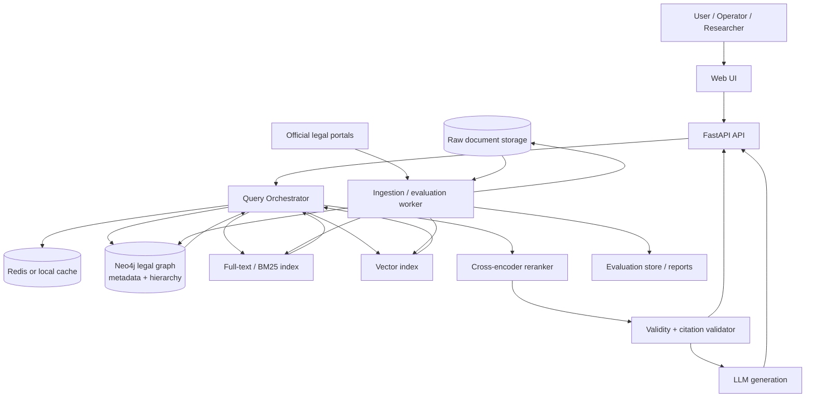
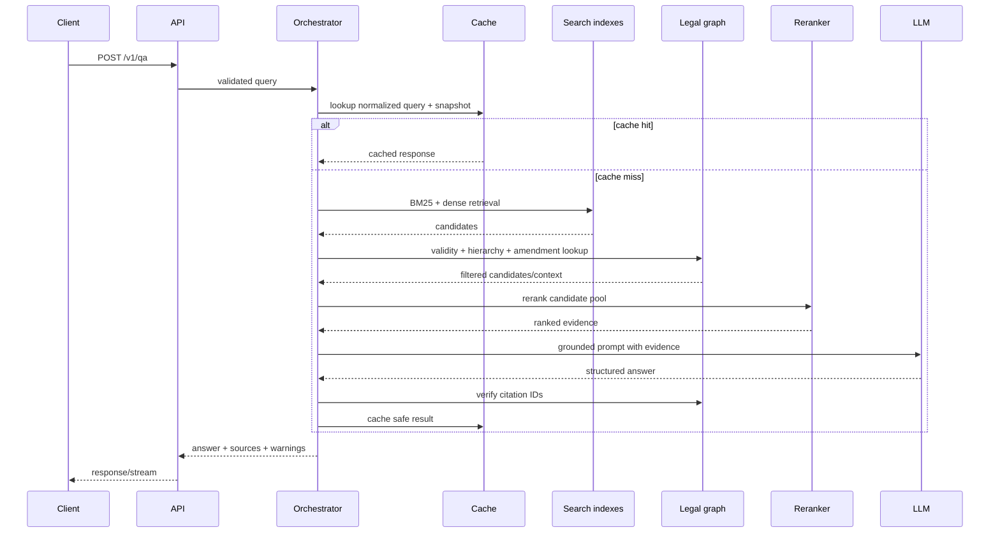

# 02. System Architecture

## Mục tiêu

Mô tả kiến trúc logic và deployment tối thiểu cho một hệ thống traffic Legal QA có thể tái lập, đánh giá và nâng cấp.

## 1. Architecture principles

1. **Retrieval trước generation:** LLM không thay thế search.
2. **Structured legal units:** article/clause/point là evidence unit, không chunk mù theo token.
3. **Validity is data:** hiệu lực được tính từ metadata/relations đã xác minh.
4. **Offline heavy work:** crawl, parse, embed và index không nằm trong request path.
5. **Small request path:** filter → retrieve → rerank → select → generate.
6. **Graceful degradation:** thiếu LLM vẫn có thể trả search results; thiếu evidence thì abstain.
7. **Simple first:** v1 dùng Neo4j cho graph và index; chỉ tách Qdrant/OpenSearch khi benchmark cần.

## 2. Logical architecture



## 3. Offline ingestion flow

```mermaid
flowchart LR
    D[Discover source] --> F[Fetch raw content]
    F --> H[Hash + immutable store]
    H --> M[Extract metadata]
    M --> P[Parse hierarchy]
    P --> R[Resolve amendments/version]
    R --> V[Validate + quality report]
    V --> E[Batch embeddings]
    E --> I[Build versioned indexes]
    I --> T[Smoke tests]
    T --> PR[Promote index]
```



## 4. Online request flow



## 5. Component decisions

| Component | v1 decision | Reason | Upgrade trigger |
|---|---|---|---|
| API | FastAPI | Hợp với Python NLP và async I/O | Traffic/concurrency thực tế vượt single service |
| Orchestrator | Một query service rõ pipeline | Dễ trace và debug hơn agent tự trị | Có nhiều tool/source và query multi-step thật sự |
| Graph | Neo4j | Phù hợp hierarchy/amendment và kế thừa repo | Graph query/index trở thành bottleneck |
| Full-text | Neo4j full-text/BM25 hoặc adapter hiện có | Ít service, dễ tái lập | Corpus/throughput yêu cầu OpenSearch |
| Vector | Neo4j vector index ban đầu | Đồng bộ đơn giản với node pháp luật | Corpus/load test chứng minh cần Qdrant |
| Raw storage | Filesystem hoặc MinIO-compatible | Lưu raw immutable, rẻ và inspect được | Cần multi-node/object lifecycle |
| Cache | In-memory/local trước; Redis khi deploy nhiều instance | Không thêm service sớm | Multi-instance hoặc cache hit đáng kể |
| Worker | CLI/job runner resumable | Đủ cho ingestion theo lô | Cần scheduling/parallel workers |
| LLM | Provider adapter, hosted/local tùy môi trường | Không khóa vendor | Cần routing/fallback nhiều provider |

Không bắt buộc dùng PostgreSQL ở v1. Job manifest và kết quả run có thể lưu JSON/SQLite; thêm PostgreSQL khi cần nhiều operator hoặc concurrent jobs.

## 6. Data and control boundaries

- Raw source không bị overwrite; mỗi fetch tạo object có hash.
- Parsed legal nodes chỉ được promote sau validation.
- Index có `index_version` và trỏ về `data_snapshot_id`.
- API chỉ đọc index active.
- Worker build index mới ngoài request path rồi atomically promote.
- LLM không có quyền ghi graph/index.

## 7. Observability boundary

Mỗi request sinh `trace_id` và log các stage:

```text
validate → rewrite → filter → lexical → dense → fusion → rerank
→ graph_expand → select_context → generate → citation_verify
```

Không log secret hoặc raw personal data. Log model/config/version để tái hiện lỗi.

## 8. Assumptions

- v1 chạy single-node hoặc Docker Compose.
- Corpus nhỏ hơn nhiều so với “millions of PDFs”; không cần sharding/IVF/PQ ngay.
- Legal graph là graph có schema và quan hệ xác định, không phải entity graph do LLM tự bịa.

## 9. Failure modes

- Một index build lỗi nhưng được promote nhầm.
- Graph và vector index khác snapshot.
- Cache không key theo snapshot/prompt/model.
- LLM trả câu trả lời nhưng citation validator không chạy.
- Một service down làm toàn bộ API mất khả năng search.

## 10. Acceptance criteria

- Sơ đồ trên phản ánh đúng request path và ingestion path thực tế.
- Có thể chạy search không cần generation.
- Có thể rebuild index từ raw data mà không sửa code thủ công.
- Mỗi response truy ngược được tới data/index/model/prompt version.
- Không có LLM call nào trực tiếp ghi dữ liệu pháp lý.
