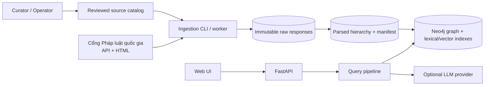
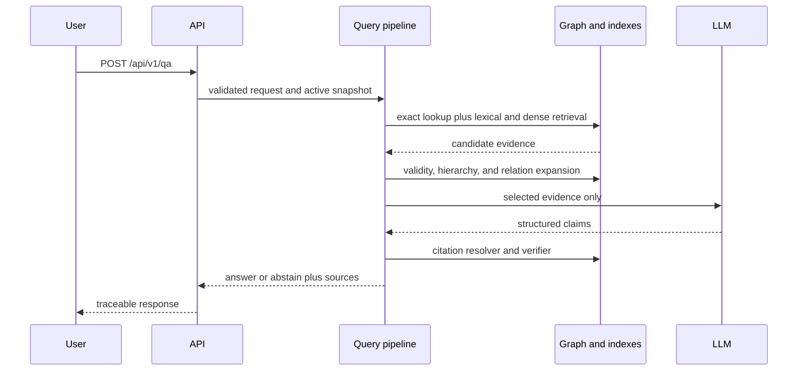

# 02. System Architecture

## Decision

v1 is a **Python modular monolith**: one repository, one API process, one worker or CLI process, and Neo4j when retrieval begins. There is no microservice split, message broker, dedicated vector store, or agent runtime in Phase 1.

The workload is offline batch ingestion, a small curated corpus, and a solo or small team. Clear module boundaries are enough to test and rebuild the system without creating distributed failure modes.

## Logical architecture



## Offline data flow

```mermaid
flowchart LR
    A[Reviewed catalog entry] --> B[Fetch portal detail JSON]
    B --> C[Store immutable raw JSON in quarantine]
    C --> D[Validate response schema]
    D --> E[Extract HTML and normalize text]
    E --> F[Parse legal hierarchy]
    F --> G[Validate units and metadata]
    G --> H[Write draft snapshot manifest]
    H --> I[Embed and build indexes]
    I --> J[Smoke test]
    J --> K[Promote active snapshot]
```



Raw response is stored before validation for audit. A failed response remains a quarantined diagnostic artifact; only validated parsed artifacts can enter a manifest or be promoted.

## Online query flow



## Planned source layout

This is a target layout, not code to scaffold now. A directory is added only in its roadmap phase.

```text
src/traffic_legal_qa/
  config.py                         # settings at process boundary
  cli.py                            # curated ingest and evaluation commands
  api/
    app.py                          # FastAPI composition
    routes.py                       # thin HTTP handlers
    schemas.py                      # request and response validation
  ingestion/
    models.py                       # portal record, metadata, legal unit
    portal.py                       # one concrete portal client
    normalize.py                    # HTML to canonical text
    parser.py                       # deterministic hierarchy parser
    storage.py                      # raw, parsed, and manifest artifacts
    pipeline.py                     # fetch, validate, store, parse
  graph/
    importer.py                     # parsed snapshot to Neo4j
    validity.py                     # deterministic temporal logic
  retrieval/
    lexical.py                      # Neo4j full-text adapter
    dense.py                        # embedding and vector adapter
    fusion.py                       # RRF
    rerank.py                       # optional bounded rerank
    service.py                      # retrieval orchestration
  qa/
    service.py                      # context selection and generation flow
    citations.py                    # deterministic citation resolver
    prompts.py                      # versioned prompt artifacts
  evaluation/
    datasets.py
    runner.py
    metrics.py
tests/
  fixtures/                         # sanitized portal JSON and HTML samples
  unit/
  integration/
```

There is deliberately no generic source interface, repository layer, factory, event bus, or queue. v1 has one portal source and one graph store. A second real implementation is the trigger for an abstraction.

## Boundary rules

| Boundary | Owns | Must not own |
|---|---|---|
| `portal.py` | HTTP request and response schema | hierarchy parsing |
| `normalize.py` | deterministic HTML-to-text | source networking or graph write |
| `parser.py` | stable IDs and parent links | LLM calls or validity claims |
| `storage.py` | hashes and artifacts | policy decisions |
| `graph/` | graph, index persistence, temporal query | HTTP request handling |
| `retrieval/` | candidate recall and ranking | answer prose |
| `qa/` | grounded response and citation verification | arbitrary database queries |
| `api/` | validation, auth/rate boundary, response shape | business logic |

## Architectural invariants

1. The API query path is read-only against one active snapshot.
2. Only promotion changes active snapshot or index pointers.
3. Every answer source resolves through `unit_id → document → raw artifact → public URL`.
4. The LLM receives selected evidence, never database credentials or unrestricted tools.
5. Portal schema validation happens before any response can enter a corpus manifest; an invalid response may remain only as a quarantined diagnostic artifact.

## Upgrade triggers

| Measured evidence | Then consider |
|---|---|
| Neo4j lexical or vector p95 misses target | Benchmark specialized search storage |
| Batch runs need durable parallel retry | Add a job store or queue |
| Multiple API replicas need a shared cache | Add Redis |
| Fixed pipeline fails multi-hop gold cases | Run a bounded agentic retrieval experiment |

Until one trigger is measured, retain the simpler architecture.
