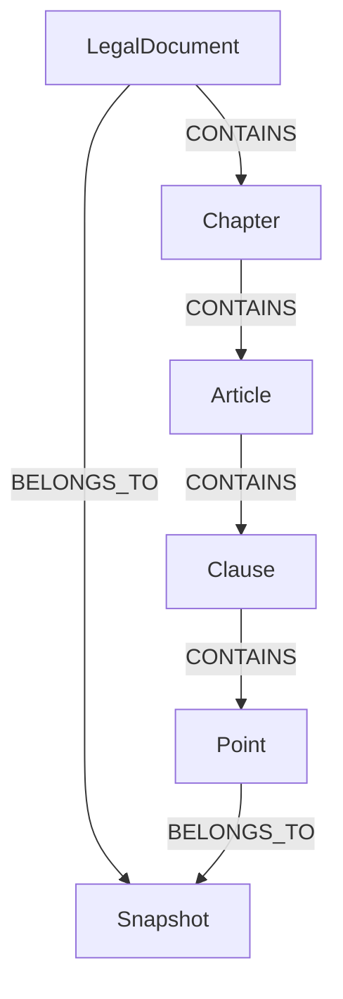

# 04. Knowledge Graph Model

## Decision

The graph is a deterministic legal graph. It represents source hierarchy, reviewed temporal relations, and snapshot lineage. It is not an open-ended entity graph inferred by an LLM.

Every node and relationship must trace to a reviewed parsed artifact and source provenance.

## Node model

| Label | Purpose | Required |
|---|---|---:|
| LegalDocument | One canonical source document inside one snapshot | Yes |
| LegalUnit | One Part, Chapter, Section, Article, Clause, or Point | Yes |
| Snapshot | Reviewed data snapshot | Yes |
| RelationEvidence | Provenance for reviewed cross-document relation | When relation exists |

Using one LegalUnit label with a unit_type property keeps the v1 import simpler. Citation IDs never use Neo4j internal IDs or vector IDs.

### LegalDocument properties

    document_key
    document_id
    portal_document_guid
    title
    document_type
    issuer
    issued_date
    effective_from
    effective_to
    status
    source_url
    content_sha256
    snapshot_id

`document_key` is `${snapshot_id}::${document_id}`. It is the graph identity; `document_id` remains the stable public legal identifier.

### LegalUnit properties

    unit_key
    unit_id
    document_id
    unit_type
    number
    title
    text
    parent_id
    path
    parser_version
    snapshot_id

`unit_key` is `${snapshot_id}::${unit_id}`. It is the graph identity; `unit_id` remains the stable public provision identifier.

## Relationship model

| Type | Direction | Meaning |
|---|---|---|
| CONTAINS | document/unit → unit | Deterministic hierarchy |
| BELONGS_TO | document/unit → snapshot | Data lineage |
| AMENDS | newer document/unit → older document/unit | Reviewed amendment |
| REPEALS | newer document/unit → older document/unit | Reviewed repeal |
| REPLACES | newer document/unit → older document/unit | Reviewed replacement |
| REFERENCES | unit → document/unit | Reviewed legal reference |
| EVIDENCED_BY | RelationEvidence → unit | Source provision that proves a relation |

Cross-document edges connect records in the same snapshot and have `relation_id`, `snapshot_id`, review status, and effective dates. The matching `RelationEvidence` node has `relation_id`, relation type, `evidence_unit_id`, source URL, raw hash, reviewer date, and note; it is linked to the source provision with `EVIDENCED_BY`. A candidate relation is stored outside the active graph or marked unreviewed; it cannot affect public validity answers.

## Hierarchy and citation

Display citation is generated server-side:

    [36/2024/QH15, Điều 11, khoản 2, điểm a]

The resolver maps display data to `(snapshot_id, unit_id)`, source URL, and parent chain. The snapshot is carried in the response metadata and citation object; a display label alone is not a database key.

## Validity model

is_effective(unit_id, effective_at, snapshot_id) returns true, false, or unknown.

- true: source metadata and reviewed relations support application at the date.
- false: source metadata or reviewed relation excludes application at the date.
- unknown: metadata or relation evidence is insufficient.

The system never uses “newer document wins” as a validity rule. If only document-level amendment is known, it must not claim a particular clause is superseded.

## Allowed graph operations

1. Resolve an exact unit and parent chain.
2. Expand a bounded number of children or siblings around selected evidence.
3. Read reviewed amendment, repeal, replacement, and reference neighbors.
4. Evaluate validity at a date.

The public API never accepts arbitrary Cypher or LLM-generated graph queries.

## Integrity checks

- Unique constraints on `(snapshot_id, document_id)`, `(snapshot_id, unit_id)`, and `snapshot_id`.
- CONTAINS is acyclic and has one deterministic parent.
- A unit belongs to exactly one document and one imported snapshot artifact.
- Every public cross-document relation has provenance and review status.
- Every `AMENDS`, `REPEALS`, `REPLACES`, or `REFERENCES` edge has a matching approved `RelationEvidence` record.
- Every citation resolves as `(active_snapshot_id, unit_id)`.

## Deferred complexity

No automatic legal relation extraction is required for v1. Start with manually reviewed document-level relations for the pilot corpus; add unit-level mappings only when a gold case requires them.
