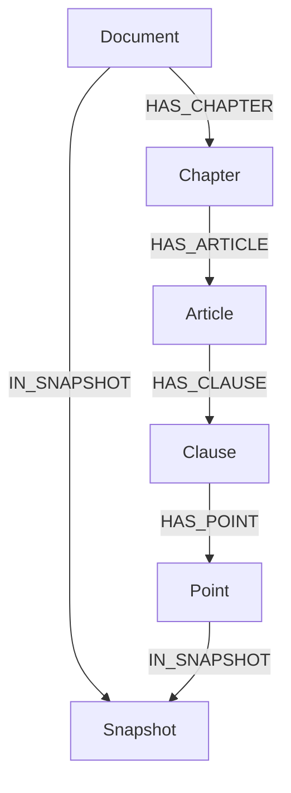

# 04. Knowledge Graph Model

## Decision

The graph is a deterministic legal graph. It represents source hierarchy, portal metadata, reviewed legal-change relations, and snapshot lineage. It is not an open-ended entity graph inferred by an LLM.

Every node and relationship must trace to a reviewed parsed artifact and source provenance.

## Node model

| Label | Purpose | Required |
|---|---|---:|
| Document | One canonical source document inside one snapshot | Yes |
| Snapshot | Reviewed data snapshot | Yes |
| DocumentType, EffectStatus | Portal-published classification/status | Yes when source provides it |
| Field | Portal `fields` or `majors` topic | Yes when source provides it |
| Organization, Signer | Issuer and signer metadata from portal | Yes when source provides it |
| Part, Chapter, Section, Article, Clause, Point | Explicit legal hierarchy labels | Yes when parser creates them |

`LegalUnit` is deliberately the generic, durable **parsed-artifact** model. It is not the Neo4j schema. The importer projects its `unit_type` to explicit labels and `HAS_*` edges, matching the legal hierarchy that users see and the topology used in the NLP-LegalQA reference. Citation IDs never use Neo4j internal IDs or vector IDs.

### Document properties

    document_key
    document_id
    portal_document_guid
    title
    document_type
    portal_document_type
    issuer
    fields
    majors
    issuing_organs
    signers
    issued_date
    effective_from
    effective_to
    status
    source_url
    content_sha256
    snapshot_id

`document_key` is `${snapshot_id}::${document_id}`. It is the graph identity; `document_id` remains the stable public legal identifier.

### Legal hierarchy properties

    unit_key
    unit_id
    document_id
    unit_type
    number
    title
    text
    parent_id
    path
    parser_version
    snapshot_id

Each explicit label (`Part` through `Point`) has these common properties. `unit_key` is `${snapshot_id}::${unit_id}`; `unit_id` remains the stable public provision identifier.

## Relationship model

| Type | Direction | Meaning |
|---|---|---|
| HAS_TYPE | Document → DocumentType | Portal document type |
| HAS_STATUS | Document → EffectStatus | Portal source-status signal |
| IN_FIELD | Document → Field | Portal field or major, with `sources` set property |
| ISSUED_BY | Document → Organization | Portal issuing organ |
| SIGNED_BY | Document → Signer | Portal signer; edge carries job title |
| HAS_PART / HAS_CHAPTER / HAS_SECTION / HAS_ARTICLE / HAS_CLAUSE / HAS_POINT | Document or parent unit → child unit | Deterministic legal hierarchy |
| IN_SNAPSHOT | Document/unit → Snapshot | Data lineage |
| AMENDS | newer provision/document → older provision/document | Approved legal change |
| RELATED_TO | Document → Document | Optional portal relation only; never a legal inference |

`IN_FIELD.sources` is the set of portal categories (`fields`, `majors`) that yielded the edge, so one document/topic pair is not duplicated. `AMENDS` carries `relation_id`, `amendment_type`, `evidence_unit_id`, `source_url`, `raw_sha256`, `snapshot_id`, `review_status`, `reviewed_at`, and `note`. A candidate relation remains outside the active graph; it cannot affect public validity answers. `RELATED_TO` is imported only when the portal actually provides it and carries `provenance: portal`; it is excluded from temporal and legal reasoning.

## Hierarchy and citation

Display citation is generated server-side:

    [36/2024/QH15, Điều 11, khoản 2, điểm a]

The resolver maps display data to `(snapshot_id, unit_id)`, source URL, and parent chain. The snapshot is carried in the response metadata and citation object; a display label alone is not a database key.

## Validity model

is_effective(unit_id, effective_at, snapshot_id) returns true, false, or unknown.

- true: source metadata and reviewed relations support application at the date.
- false: source metadata or reviewed relation excludes application at the date.
- unknown: metadata or relation evidence is insufficient.

The system never uses “newer document wins” as a validity rule. If only document-level amendment is known, it must not claim a particular clause is superseded.

## Allowed graph operations

1. Resolve an exact unit and parent chain.
2. Expand a bounded number of children or siblings around selected evidence.
3. Read approved `AMENDS` neighbors and their evidence locator.
4. Evaluate validity at a date.

The public API never accepts arbitrary Cypher or LLM-generated graph queries.

## Integrity checks

- Unique constraints on `(snapshot_id, document_id)`, each hierarchy label's `(snapshot_id, unit_id)`, and `snapshot_id`.
- Every `HAS_*` hierarchy path is acyclic and each unit has one deterministic parent.
- A unit belongs to exactly one document and one imported snapshot artifact.
- Every public cross-document relation has provenance and review status.
- Every `AMENDS` edge has the approved relation artifact's evidence and review properties.
- Every citation resolves as `(active_snapshot_id, unit_id)`.

## Deferred complexity

No automatic legal relation extraction is required for v1. Start with reviewed provision-level mappings for the four seed amendment chains; add more only when an evaluation case exposes a coverage gap. `DocumentGroup` and related-document stubs are not created until the current portal source actually provides the needed metadata.
