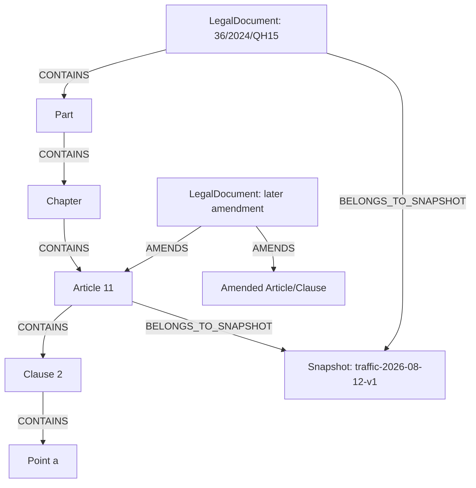

# 04. Knowledge Graph Model

## Mục tiêu

Biểu diễn cấu trúc văn bản và quan hệ pháp lý có nguồn gốc rõ ràng để hỗ trợ retrieval, validity filtering, context expansion và citation.

## 1. Modeling decision

Graph của hệ thống là **deterministic legal graph**, không phải knowledge graph mở do LLM tự trích xuất. Mỗi node/edge pháp lý phải truy ngược được tới document snapshot và source locator.

## 2. Node types

| Label | Ý nghĩa | Bắt buộc |
|---|---|---:|
| `LegalDocument` | Luật, nghị định, thông tư, quyết định hoặc văn bản liên quan | Có |
| `Part` | Phần | Nếu có |
| `Chapter` | Chương | Nếu có |
| `Section` | Mục | Nếu có |
| `Article` | Điều | Có |
| `Clause` | Khoản | Nếu có |
| `Point` | Điểm | Nếu có |
| `Appendix` | Phụ lục | Nếu corpus cần |
| `Snapshot` | Phiên bản data/index | Có ở control plane |

Trong implementation có thể dùng một label `LegalUnit` kèm `unit_type`, nhưng ID và hierarchy phải ổn định.

## 3. Node properties

### LegalDocument

```text
document_id          số hiệu chuẩn hóa, unique
title
document_type        law/decree/circular/decision/other
issuer
issued_date
effective_from
effective_to
status               current/repealed/amended/unknown
domain               traffic
source_url
source_hash
snapshot_id
```

### LegalUnit

```text
unit_id              immutable logical ID
document_id
unit_type            part/chapter/section/article/clause/point
number
title
text
normalized_text
parent_id
path                 stable parent-to-self unit IDs
validity
source_locator
parser_version
```

`unit_id` phải giữ được citation ngay cả khi text được re-index. Không dùng vector ID làm citation ID.

## 4. Relationship types

| Relationship | Hướng | Ý nghĩa |
|---|---|---|
| `CONTAINS` | parent → child | Cấu trúc văn bản |
| `PART_OF` | child → parent | Shortcut tùy query |
| `AMENDS` | amendment doc/unit → amended doc/unit | Sửa đổi/bổ sung |
| `REPEALS` | new doc/unit → old doc/unit | Bãi bỏ |
| `REPLACES` | new doc/unit → old doc/unit | Thay thế |
| `GUIDES` | guidance doc → target doc/unit | Hướng dẫn |
| `REFERENCES` | unit → referenced unit | Dẫn chiếu |
| `SAME_AS` | unit ↔ unit | Chỉ dùng khi có căn cứ xác minh |
| `BELONGS_TO_SNAPSHOT` | unit/doc → snapshot | Data lineage |

Không tạo `AMENDS` chỉ vì hai văn bản có cùng từ khóa. Relation phải có source/provenance.

## 5. Graph schema



## 6. Validity model

### 6.1 Status semantics

- `current`: có căn cứ cho thấy áp dụng tại `effective_at`.
- `repealed`: bị bãi bỏ toàn bộ hoặc phần tương ứng.
- `amended`: bản gốc có sửa đổi; answer phải lấy text/quan hệ hiện hành phù hợp.
- `unknown`: chưa đủ metadata; không được trình bày như current.

### 6.2 Effective date query

Hàm logic cần có:

```text
is_effective(unit_id, effective_at, snapshot_id) -> true/false/unknown
```

Kết quả `unknown` là trạng thái hợp lệ và phải được đưa vào warning. Không dùng heuristic “văn bản mới hơn thì đúng hơn” thay cho hàm này.

### 6.3 Version lineage

Lineage phải cho phép:

```text
current unit
→ amendment source
→ previous unit/document
→ effective dates
→ source evidence
```

Nếu chỉ biết document được sửa đổi nhưng chưa map được article/clause cụ thể, relation chỉ ở document level và không được claim rằng một điều cụ thể đã bị thay thế.

## 7. Retrieval-oriented graph operations

Các operation được allowlist:

1. lấy parent chain của evidence;
2. lấy sibling cùng article khi evidence là clause/point;
3. lấy child units để bổ sung điều kiện/ngoại lệ;
4. lấy amendment/repeal/replacement neighbors;
5. lấy referenced units tối đa depth giới hạn;
6. kiểm tra validity tại một ngày.

Không cho LLM sinh Cypher tùy ý trong public API. Nếu cần text-to-Cypher cho nghiên cứu, query phải read-only, giới hạn node/depth/time và validate AST/allowlist.

## 8. Citation mapping

Citation có thể hiển thị:

```text
[36/2024/QH15, Điều 11, khoản 2, điểm a]
```

Backend giữ mapping:

```text
display_citation → unit_id → graph node → source_url + locator
```

Citation validator phải reject ID không tồn tại, ID ngoài active snapshot hoặc ID không nằm trong evidence set của answer.

## 9. Assumptions

- Hierarchy có thể parse ổn định hơn entity extraction tự do.
- Một legal unit có thể bị sửa đổi một phần; model phải hỗ trợ relation ở clause/point level.
- Một document có thể có nhiều snapshot nhưng logical ID vẫn ổn định.

## 10. Failure modes

- Edge direction ngược làm validity traversal sai.
- Merge theo title thay vì document number gây gộp nhầm.
- Node current vẫn trỏ text cũ sau amendment.
- Quan hệ candidate bị dùng như quan hệ đã xác minh.
- Graph expansion lấy quá nhiều sibling làm nhiễu context.

## 11. Acceptance criteria

- Có uniqueness constraint cho document/unit ID.
- Mọi `CONTAINS` tạo được một cây hierarchy không có cycle.
- Mọi amendment/repeal/replacement edge có provenance.
- Query validity trả được `true/false/unknown`.
- Citation từ answer luôn resolve về unit tồn tại trong snapshot.
- Graph expansion có depth/limit cố định và có test cho edge direction.
