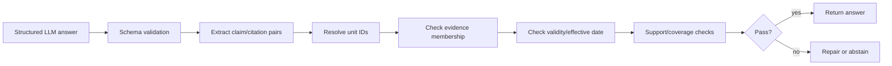

# 06. Generation and Citation Policy

## Mục tiêu

Đảm bảo câu trả lời dễ hiểu nhưng chỉ dựa trên evidence đã truy hồi và citation đã kiểm chứng.

## 1. Generation contract

Generator nhận:

```text
original_question
rewritten_question (optional)
effective_at
evidence[]
validity_summary
response_policy_version
```

Generator không được nhận toàn bộ database hoặc quyền truy cập tùy ý vào graph.

## 2. Structured output

LLM phải trả schema tương đương:

```json
{
  "answer": "string",
  "claims": [
    {
      "text": "string",
      "citation_unit_ids": ["string"]
    }
  ],
  "warnings": ["string"],
  "needs_clarification": false,
  "abstain": false,
  "confidence_label": "high|medium|low"
}
```

JSON phải được parse và validate. Nếu invalid: retry một lần với format reminder; nếu vẫn lỗi, trả fallback evidence list hoặc error an toàn.

## 3. Grounding rules

System prompt phải yêu cầu:

- chỉ dùng evidence được đánh dấu;
- không bịa số hiệu, mức phạt, ngày hiệu lực hoặc citation;
- phân biệt nội dung văn bản và suy luận giải thích;
- nêu điều kiện/ngoại lệ nếu evidence chứa chúng;
- không khẳng định current nếu validity là unknown;
- hỏi lại khi thiếu loại phương tiện, hành vi, thời điểm hoặc địa điểm quan trọng;
- trả abstain nếu không có evidence hỗ trợ.

User content và document text được đặt trong vùng dữ liệu, không được coi là instruction. Citation marker do hệ thống tạo, không do LLM tự đặt.

## 4. Citation policy

Một claim pháp lý được xem là có citation hợp lệ khi:

1. unit ID tồn tại;
2. unit nằm trong active data snapshot;
3. unit xuất hiện trong evidence truyền vào generator;
4. text của unit có mức support phù hợp claim;
5. validity không mâu thuẫn với câu hỏi/thời điểm.

Nếu một claim cần nhiều điều khoản, phải gắn đủ các unit. Không gắn một citation chung cho cả đoạn nếu citation không support toàn bộ claim.

## 5. Citation verification pipeline



Repair chỉ được thêm citation đã có trong evidence; không được cho LLM search tự do trong bước repair.

## 6. Answer styles

### Direct answer

Dùng cho câu hỏi rõ, một hoặc vài evidence trực tiếp.

### Conditional answer

Dùng khi kết quả phụ thuộc loại phương tiện, mức độ vi phạm, thời điểm hoặc điều kiện khác.

### Clarification

Dùng khi thiếu biến quyết định và không thể trả lời an toàn.

### Abstention

Dùng khi:

- không có candidate đủ liên quan;
- validity quan trọng nhưng unknown;
- citation validator fail;
- evidence mâu thuẫn chưa resolve;
- câu hỏi ngoài domain.

## 7. User-facing disclaimer

UI nên hiển thị ngắn gọn:

> Thông tin mang tính tra cứu, dựa trên data snapshot hiển thị bên dưới và không thay thế tư vấn pháp lý chính thức. Hãy kiểm tra văn bản gốc khi quyết định hành động.

Không chèn disclaimer dài vào mọi câu trả lời làm giảm usability; warning phải xuất hiện nổi bật khi confidence thấp hoặc validity unknown.

## 8. Prompt management

Prompt là artifact có:

```text
prompt_name
prompt_version
model
input_schema
output_schema
golden_cases
change_reason
```

Mọi thay đổi prompt phải chạy regression cases cho:

- exact citation;
- current/repealed distinction;
- multi-document question;
- ambiguity/clarification;
- out-of-domain refusal;
- prompt injection.

## 9. Cost and latency policy

- Dùng model nhỏ cho rewrite/classification nếu benchmark đủ.
- Cache embedding và câu hỏi deterministic.
- Rerank candidate pool nhỏ.
- Context tối đa theo token budget.
- Log input/output token và estimated cost.
- Stream answer nếu UI dùng chat; structured final object vẫn phải được validate trước khi hoàn tất.

## 10. Assumptions

- LLM chỉ làm query transformation và language generation.
- Legal truth nằm trong graph/index/source snapshot.
- Confidence label là product signal, không phải xác suất pháp lý tuyệt đối.

## 11. Failure modes

- LLM trích dẫn ID giả.
- Claim đúng nhưng citation sai.
- Citation đúng nhưng answer thêm chi tiết không có trong evidence.
- Output JSON malformed.
- Prompt injection trong document text khiến model bỏ policy.
- Retry tạo câu trả lời khác nhưng không log version.

## 12. Acceptance criteria

- Không có citation nào được trả nếu không resolve.
- Claim không support bị xóa, sửa hoặc chuyển abstain.
- Output malformed không làm API crash.
- Có regression set cho prompt và citation.
- UI hiển thị nguồn và cảnh báo rõ ràng.
