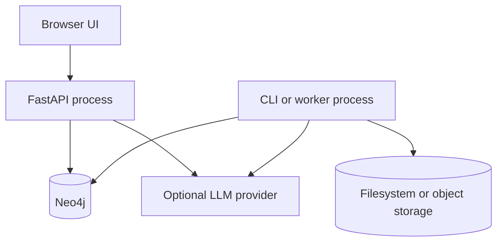

# 10. Deployment Plan

## Environments

| Environment | Purpose | Data |
|---|---|---|
| dev | Parser and service development | Sanitized fixtures and tiny local snapshot |
| eval | Reproducible benchmark | Frozen snapshot and held-out gold set |
| demo | Portfolio demonstration | Promoted reviewed traffic snapshot |

Dev must not write to the demo snapshot.

## v1 topology

Docker Compose is sufficient once API, graph, and UI exist. A cluster orchestrator is not a v1 requirement.

Phase 2A provides `compose.yaml` with a loopback-only Neo4j Community `5.26.28` container, Bolt on `7687`, Browser on `7474`, and a `cypher-shell` health check. Set `NEO4J_PASSWORD` in the process environment; it is required by Compose and the graph CLI, and `.env` is ignored. The graph is rebuilt from parsed artifacts, so no Neo4j database volume is committed.

## Responsibilities

- API: read-only QA/search path, health/readiness, input boundary, rate limits.
- Worker or CLI: curated fetch, artifact storage, parse, reviewed-relation validation, graph projection, batch embedding, index build, evaluation, and promotion. None of these jobs run in a user request.
- Neo4j: legal graph plus lexical and vector indexes.
- Artifact storage: raw response, normalized text, parsed documents, approved relation artifacts, manifests, reports, and evaluation outputs.
- LLM provider: optional generation dependency behind a small provider adapter.

## Configuration contract

The future runtime configuration contains only environment-specific values:

    APP_ENV
    ARTIFACT_ROOT
    ACTIVE_SNAPSHOT_ID
    NEO4J_URI
    NEO4J_USERNAME
    NEO4J_PASSWORD
    EMBEDDING_MODEL
    RERANKER_MODEL
    LLM_PROVIDER
    LLM_MODEL
    LLM_TIMEOUT_SECONDS
    RATE_LIMIT

Secrets never enter Git, images, or logs.

## Release flow

    commit
    → unit and contract tests
    → fixture ingestion
    → build draft snapshot and indexes
    → retrieval smoke tests
    → evaluation gate
    → promote snapshot
    → demo monitoring

Code release and data/index promotion have separate version IDs.

## Rollback

- Keep raw artifacts, manifests, gold set, and at least active plus previous snapshot.
- Roll back by moving the active snapshot/index pointer, not by rebuilding under incident pressure.
- Re-run citation-resolution smoke tests after rollback.
- If the source portal is unavailable, retain the last promoted snapshot and expose its date.

## Scaling triggers

| Observation | Next action |
|---|---|
| Search p95 misses target | Benchmark query and index optimization before new storage |
| More than one API instance | Add shared cache only if measurements justify it |
| Ingest duration blocks planned refresh | Add bounded worker parallelism, then durable queue if needed |
| LLM cost is too high | Benchmark cache, smaller model, or provider routing |
| Corpus or throughput exceeds Neo4j capability | Evaluate specialized index storage using same gold set |

## Deployment acceptance

A clean machine can run the dev fixture path and the demo path from documented commands. Health and readiness are separate, and readiness remains false until a promoted snapshot is available.
