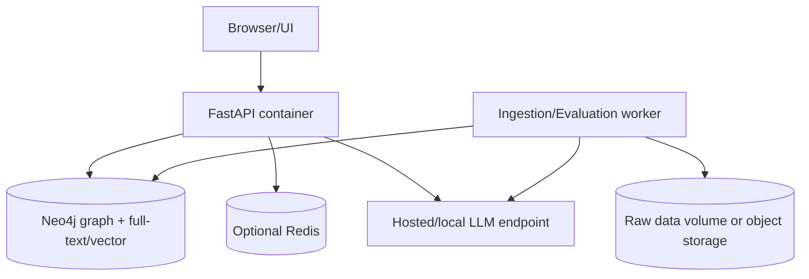

# 10. Deployment Plan

## Mục tiêu

Đưa hệ thống từ local development tới một demo có thể chạy lại và trình diễn như sản phẩm hoàn chỉnh, nhưng không triển khai hạ tầng lớn khi chưa cần.

## 1. Environments

| Environment | Mục đích | Dữ liệu |
|---|---|---|
| `dev` | Parser/retrieval development | Fixture nhỏ |
| `eval` | Benchmark/ablation | Snapshot cố định, QA gold |
| `demo` | UI/API trình diễn | Active traffic snapshot |

Không dùng cùng index writable cho dev và demo.

## 2. Recommended v1 deployment



Docker Compose là đủ cho v1. Không cần Kubernetes.

## 3. Service responsibilities

- `api`: read-only query path, health/readiness, auth/rate limit.
- `worker`: discovery, fetch, parse, relation validation, embeddings, index build, evaluation.
- `neo4j`: legal graph và index được version hóa.
- `raw storage`: immutable raw content/manifest/reports.
- `redis`: optional cache; không chứa source of truth.
- `llm`: external dependency qua provider adapter.

## 4. Configuration

Configuration phải qua environment/config file, không hardcode:

```text
APP_ENV
NEO4J_URI
NEO4J_USERNAME
NEO4J_PASSWORD
RAW_STORAGE_PATH
ACTIVE_SNAPSHOT_ID
EMBEDDING_MODEL
RERANKER_MODEL
LLM_PROVIDER
LLM_MODEL
LLM_TIMEOUT_SECONDS
RATE_LIMIT
```

Secret không commit vào repository. `.env.example` chỉ chứa placeholder.

## 5. Release flow

```text
commit
→ unit/parser tests
→ build image
→ ingest/eval fixture
→ security/contract checks
→ build data snapshot/index
→ retrieval smoke tests
→ promote demo config
→ monitor
```

Code release và data/index release có ID riêng.

## 6. Backup and rollback

- Backup raw data, manifest và QA set.
- Export graph/index metadata hoặc volume snapshot.
- Giữ ít nhất index active và index previous.
- Rollback bằng đổi `ACTIVE_SNAPSHOT_ID`/`ACTIVE_INDEX_VERSION`, không rebuild ngay trong incident.
- Kiểm tra citation resolver sau rollback.

## 7. Scaling triggers

Chỉ nâng cấp khi có số đo:

| Trigger | Upgrade |
|---|---|
| Vector search p95 vượt target | Benchmark Qdrant |
| Full-text query bottleneck | Benchmark OpenSearch |
| Nhiều API replicas | Redis và external job store |
| Ingest chạy quá lâu | Worker parallelism/job queue |
| Graph query bottleneck | Query/index optimization trước khi tách graph |
| LLM cost quá cao | Model routing/cache/local inference |

## 8. Assumptions

- Demo có thể dùng một máy có Neo4j và optional GPU cho reranker.
- API không cần public internet exposure trong giai đoạn đầu.
- Data update theo lịch/manual trigger, không yêu cầu streaming CDC.

## 9. Failure modes

- Container chạy nhưng index chưa ready.
- LLM env thiếu key làm health check sai.
- Volume mất khiến graph còn nhưng raw manifest mất.
- Promote snapshot chưa smoke-test.
- Version code mới đọc schema snapshot cũ không tương thích.

## 10. Acceptance criteria

- Một người mới có thể chạy dev/eval/demo theo README/deployment notes.
- Health và readiness phân biệt process sống với dependency sẵn sàng.
- Có rollback snapshot/index được kiểm thử.
- Không secret trong image/log/repository.
- Deployment không yêu cầu cluster phức tạp cho v1.
